# 🍜 Phở Paradise - Vietnamese Food Ordering App

A modern, full-stack food ordering application for authentic Vietnamese cuisine. Built with Next.js, TypeScript, MongoDB, and Stripe for seamless online ordering and payment processing.


## ✨ Features

### 🛒 Customer Features
- **Browse Menu**: View authentic Vietnamese dishes with images, descriptions, ratings, and prep times
- **Category Filtering**: Filter by dish categories (Phở, Bánh Mì, Appetizers, etc.) or view all items organized by sections
- **Favorites**: Mark your favorite dishes for quick access
- **Search**: Real-time search across menu items by name or description
- **Customization**: 
  - Choose spice levels (Mild, Medium, Hot)
  - Add extras (Extra Meat, Vegetables, Noodles, Fried Egg, Spring Rolls)
- **Shopping Cart**: 
  - Add/remove items with quantity controls
  - Persistent cart (saved in localStorage)
  - Special instructions for your order
  - Real-time price calculation with delivery fee
- **Secure Checkout**: Stripe payment integration for safe transactions
- **Order Tracking**: Real-time order status updates with visual progress tracker
- **User Authentication**: Register and login to save order history

### 🔄 Automated Order Management
- **Auto-Progress System**: Orders automatically progress through statuses:
  - Pending → Preparing (configurable delay)
  - Preparing → Ready (configurable delay)
  - Ready → Delivered (configurable delay)
- **Real-Time Updates**: Order tracking page auto-refreshes every 10 seconds
- **Background Processing**: Auto-progress runs every 30 seconds on both homepage and order tracking pages

### 🎨 UI/UX Features
- **Dark Theme**: Modern, sleek dark interface with amber accents
- **Responsive Design**: Fully responsive for mobile, tablet, and desktop
- **Smooth Animations**: Fade-in, slide, and scale animations throughout
- **Image Zoom**: Click menu item images to view enlarged versions
- **Mobile Cart**: Floating cart button on mobile devices
- **Loading States**: Elegant loading indicators for all async operations

## 🚀 Tech Stack

### Frontend
- **Framework**: Next.js 14 (App Router)
- **Language**: TypeScript
- **Styling**: Tailwind CSS
- **Icons**: Lucide React
- **Image Optimization**: Next.js Image component

### Backend
- **Runtime**: Node.js
- **API**: Next.js API Routes
- **Database**: MongoDB with Mongoose ODM
- **Authentication**: JWT-based authentication
- **Password Hashing**: bcryptjs

### Payment Processing
- **Provider**: Stripe
- **Features**: Checkout sessions, webhook handling for order confirmation

### Development Tools
- **Package Manager**: npm/yarn
- **Linting**: ESLint
- **Type Checking**: TypeScript

## 📦 Installation

### Prerequisites
- Node.js 18+ installed
- MongoDB database (local or MongoDB Atlas)
- Stripe account for payment processing

### Steps

1. **Clone the repository**
```bash
   git clone https://github.com/tuanwinnn/pho-ordering-app.git
   cd pho-paradise
```

2. **Install dependencies**
```bash
   npm install
```

3. **Set up environment variables**
   
   Create a `.env.local` file in the root directory:
```env
   # MongoDB
   MONGODB_URI=your_mongodb_connection_string

   # JWT
   JWT_SECRET=your_secure_jwt_secret_key

   # Stripe
   NEXT_PUBLIC_STRIPE_PUBLISHABLE_KEY=your_stripe_publishable_key
   STRIPE_SECRET_KEY=your_stripe_secret_key
   STRIPE_WEBHOOK_SECRET=your_stripe_webhook_secret

   # App URL
   NEXT_PUBLIC_APP_URL=http://localhost:3000
```

4. **Seed the database (optional)**
```bash
   npm run seed
```

5. **Run the development server**
```bash
   npm run dev
```

6. **Open your browser**
   
   Navigate to [http://localhost:3000](http://localhost:3000)

7. **Admin Dasboard**
       
    Navigate to [http://localhost:3000/admin](http://localhost:3000/admin)


## 🗂️ Project Structure
```
pho-paradise/
├── src/
│   ├── app/
│   │   ├── api/
│   │   │   ├── auth/              # Authentication endpoints
│   │   │   ├── menu/              # Menu CRUD operations
│   │   │   ├── orders/            # Order management
│   │   │   ├── auto-progress-orders/  # Auto-progression system
│   │   │   ├── create-checkout-session/  # Stripe checkout
│   │   │   └── webhook/           # Stripe webhook handler
│   │   ├── orders/
│   │   │   └── [id]/              # Order tracking page
│   │   ├── profile/               # User profile page
│   │   └── page.tsx               # Homepage (main menu)
│   ├── components/
│   │   └── AuthModal.tsx          # Login/Register modal
│   ├── context/
│   │   └── AuthContext.tsx        # Authentication context
│   ├── lib/
│   │   └── mongodb.ts             # MongoDB connection
│   └── models/
│       ├── User.ts                # User schema
│       ├── MenuItem.ts            # Menu item schema
│       └── Order.ts               # Order schema
├── public/
│   └── images/                    # Menu item images
├── .env.local                     # Environment variables
├── package.json
├── tsconfig.json
└── tailwind.config.ts
```

## 🔧 Configuration

### Auto-Progress Timing

Edit `src/app/api/auto-progress-orders/route.ts` to adjust order progression delays:
```typescript
const STATUS_PROGRESSION = {
  'pending': { next: 'preparing', delayMinutes: 2 },      // Demo: 0.1 for 6 seconds
  'preparing': { next: 'ready', delayMinutes: 15 },       // Demo: 0.1 for 6 seconds
  'ready': { next: 'delivered', delayMinutes: 20 },       // Demo: 0.1 for 6 seconds
  'delivered': null
};
```

### Delivery Fee

Edit `src/app/page.tsx`:
```typescript
const DELIVERY_FEE = 3.99; // Change to your desired fee
```

### Add-ons

Edit `src/app/page.tsx`:
```typescript
const AVAILABLE_ADDONS: AddOn[] = [
  { name: 'Extra Meat', price: 3.50 },
  { name: 'Extra Vegetables', price: 2.00 },
  // Add more addons here
];
```

## 🎯 Usage

### For Customers

1. **Browse Menu**: Click on categories or use "All" to see everything
2. **Add to Cart**: Click "Add to Cart" for quick add, or "Add-ons" to customize
3. **Customize**: Select spice level and optional add-ons
4. **Checkout**: Review cart, add special instructions, and click "Place Order"
5. **Pay**: Complete payment through Stripe
6. **Track Order**: View real-time order status on the tracking page

### For Developers

#### Add New Menu Items

Use the API or directly add to MongoDB:
```javascript
// POST /api/menu
{
  "name": "Phở Bò",
  "description": "Traditional beef noodle soup",
  "price": 12.99,
  "category": "Phở",
  "image": "/images/pho-bo.jpg",
  "rating": 4.8,
  "prepTime": "15-20 min"
}
```

#### Set Up Stripe Webhooks

1. Install Stripe CLI: `brew install stripe/stripe-cli/stripe`
2. Login: `stripe login`
3. Forward webhooks: `stripe listen --forward-to localhost:3000/api/webhook`
4. Copy the webhook signing secret to `.env.local`

## 🧪 Testing

### Manual Testing

1. **Order Flow**:
   - Add items to cart
   - Complete checkout
   - Track order on `/orders/[orderId]`
   - Watch status auto-progress

2. **Auto-Progress**:
   - Place an order
   - Wait 30 seconds (or configured interval)
   - Refresh order page to see status change

### Test Stripe Payment

Use Stripe test cards:
- Success: `4242 4242 4242 4242`
- Decline: `4000 0000 0000 0002`
- Expiry: Any future date
- CVC: Any 3 digits
- ZIP: Any 5 digits

## 🚀 Deployment

### Environment Variables for Production

Update these in your hosting platform:
- `MONGODB_URI` - Production MongoDB connection
- `JWT_SECRET` - Strong random secret
- `STRIPE_SECRET_KEY` - Live Stripe key
- `STRIPE_WEBHOOK_SECRET` - Production webhook secret
- `NEXT_PUBLIC_APP_URL` - Your production URL

## 📝 API Documentation

### Authentication

- `POST /api/auth/register` - Register new user
- `POST /api/auth/login` - Login user
- `GET /api/auth/me` - Get current user

### Menu

- `GET /api/menu` - Get all menu items
- `GET /api/menu/[id]` - Get single menu item
- `POST /api/menu` - Create menu item (admin)
- `PUT /api/menu/[id]` - Update menu item (admin)
- `DELETE /api/menu/[id]` - Delete menu item (admin)

### Orders

- `POST /api/create-checkout-session` - Create Stripe checkout
- `GET /api/orders` - Get user's orders
- `GET /api/orders/[id]` - Get single order
- `GET /api/auto-progress-orders` - Trigger order status progression

### Webhooks

- `POST /api/webhook` - Stripe webhook handler

## 🤝 Contributing

Contributions are welcome! Please follow these steps:

1. Fork the repository
2. Create a feature branch (`git checkout -b feature/AmazingFeature`)
3. Commit your changes (`git commit -m 'Add some AmazingFeature'`)
4. Push to the branch (`git push origin feature/AmazingFeature`)
5. Open a Pull Request

## 📄 License

This project is licensed under the MIT License - see the LICENSE file for details.

## 🙏 Acknowledgments

- Vietnamese cuisine inspiration
- Next.js team for the amazing framework
- Stripe for secure payment processing
- MongoDB for reliable data storage
- Lucide React for beautiful icons


## 🍜 About Phở Paradise

This is a demo food ordering application showcasing full-stack development skills.

*Fictional restaurant contact (part of the demo):*
- Email: hello@phoparadise.com
- Phone: (510) 555-PHỞ (7467)
- Location: Oakland, CA

## 📧 Contact

**Developer:** Tuan Nguyen
- GitHub: [@tuanwinnn](https://github.com/tuanwinnn)
- LinkedIn: [Tuan Nguyen](https://www.linkedin.com/in/tuan-nguyen-237656326/)

---

**Made with ❤️ and 🍜 by [Tuan Nguyen]**

*Bringing authentic Vietnamese flavors to your doorstep since 2015*

## 📸 Screenshots

### 🏠 Main Application

**Homepage - Browse Menu**
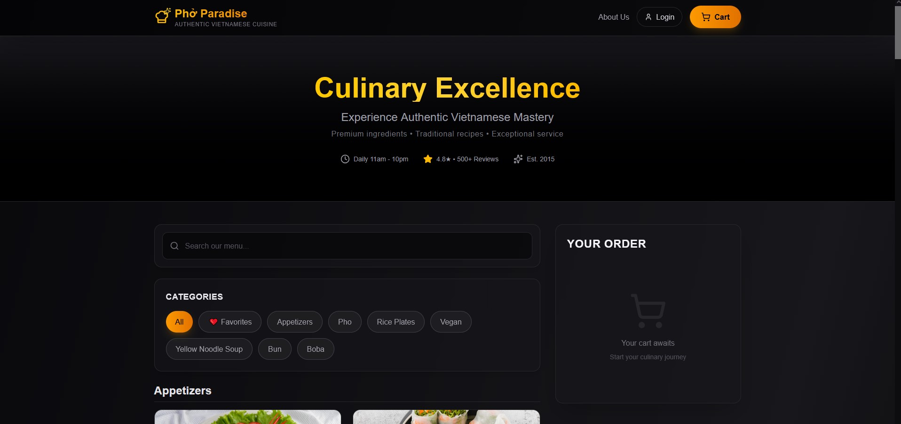

**Category View**
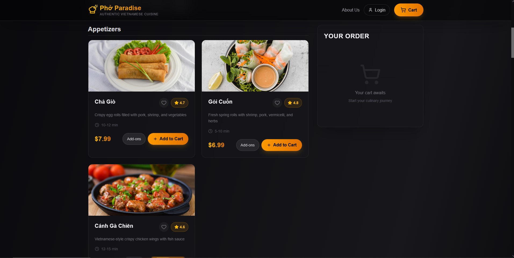

**Menu Items**
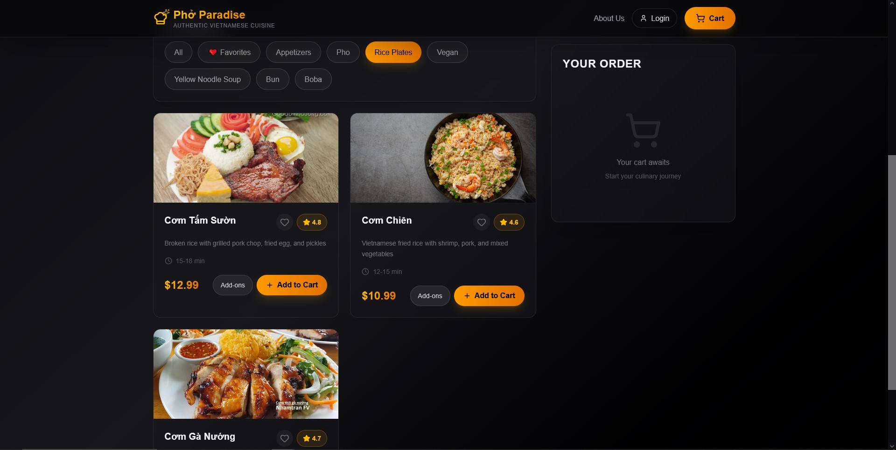

---

### 🛒 Ordering Process

**Customize Your Order**
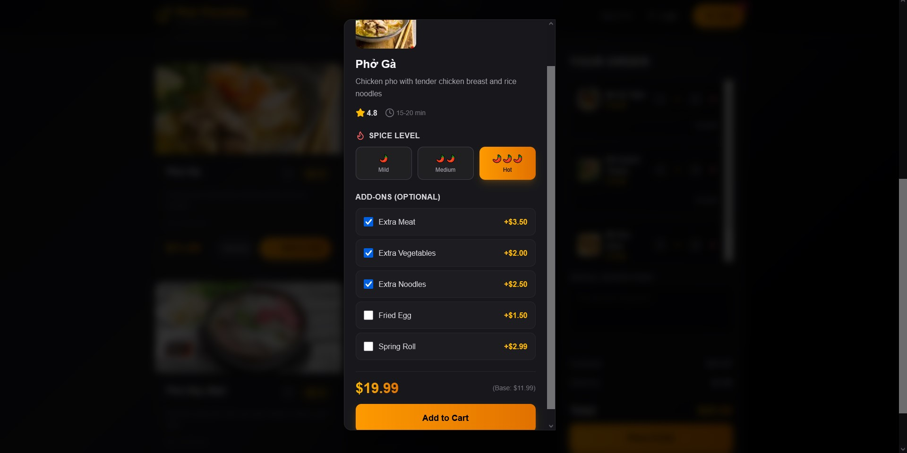

**Shopping Cart**
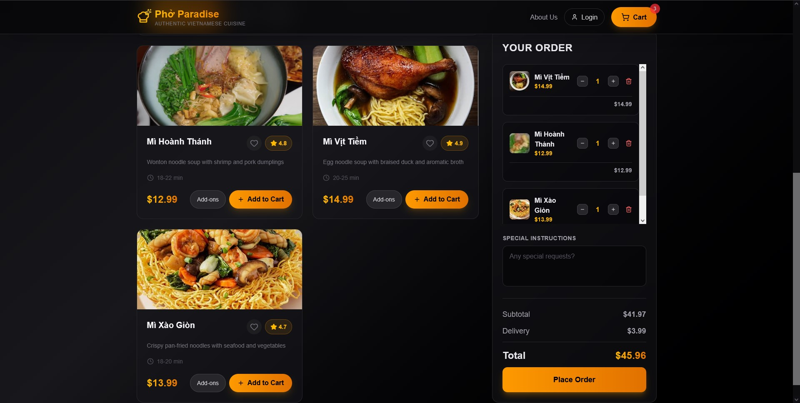

**Secure Stripe Checkout**
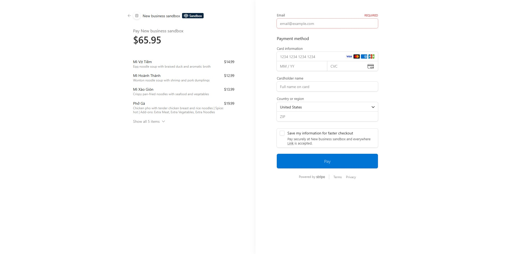

---

### 📦 Order Tracking

**Order Confirmed**
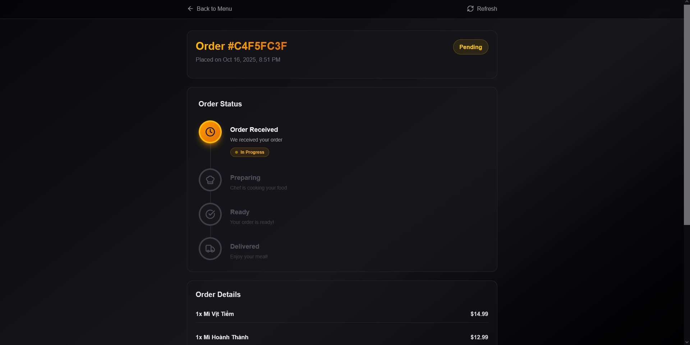

**Order Status - Preparing**


**Order Delivered**


---

### 👨‍💼 Admin Features

**Admin Dashboard**
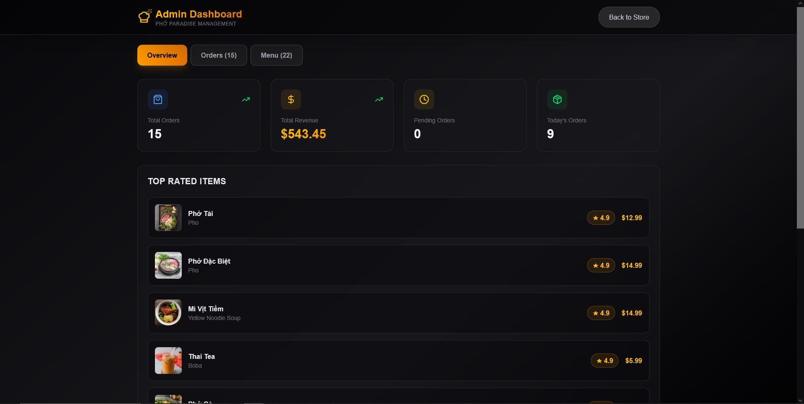

**Manage Menu Items**
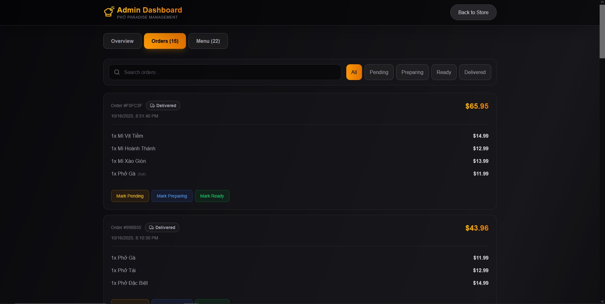

**Order Management**
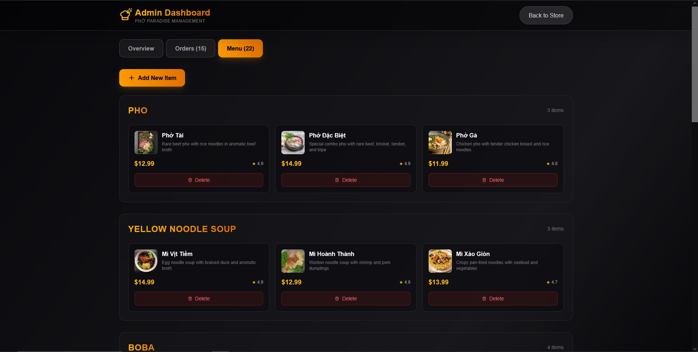

**Analytics**
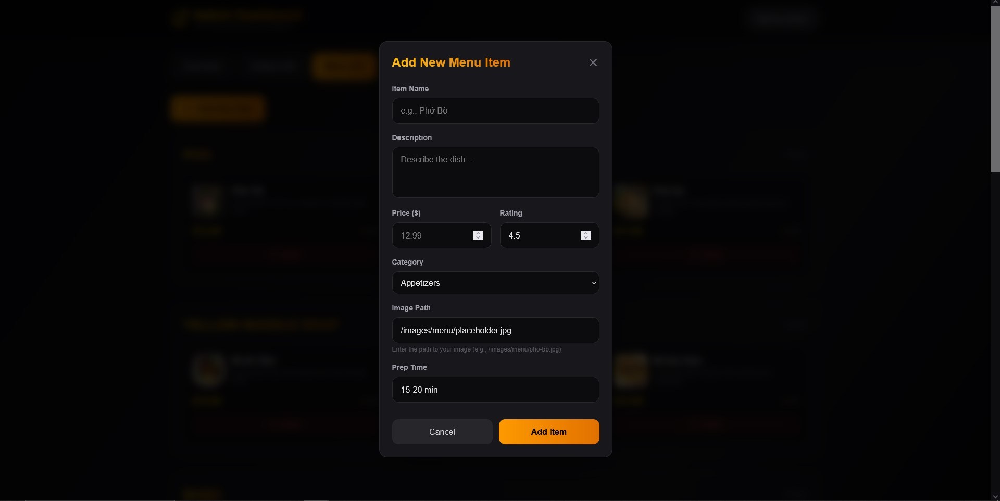